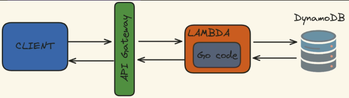
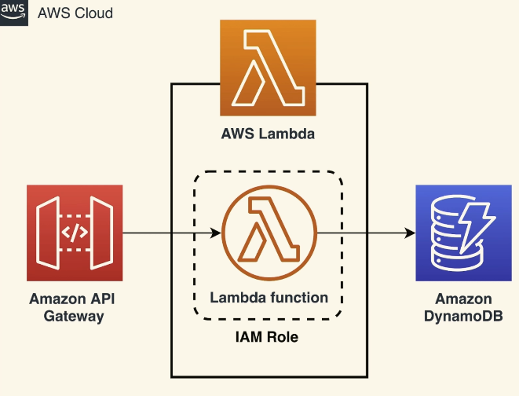
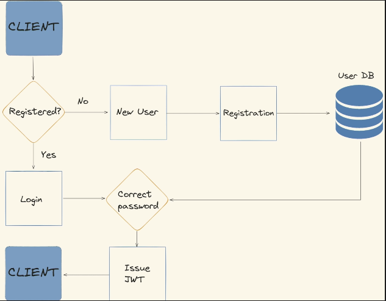

# GO with AWS

I explored deploying Go Services on AWS infrastructure using AWS CDK. I used AWS Lambda, API Gateway, CloudWatch and Cloud Formation to create 3 endpoints: Register, Login and Access through Protected route. I used JWT to validate the users. 

## Useful commands

 * `cdk deploy`      deploy this stack to your default AWS account/region
 * `cdk diff`        compare deployed stack with current state
 * `cdk synth`       emits the synthesized CloudFormation template
 * `go test`         run unit tests
